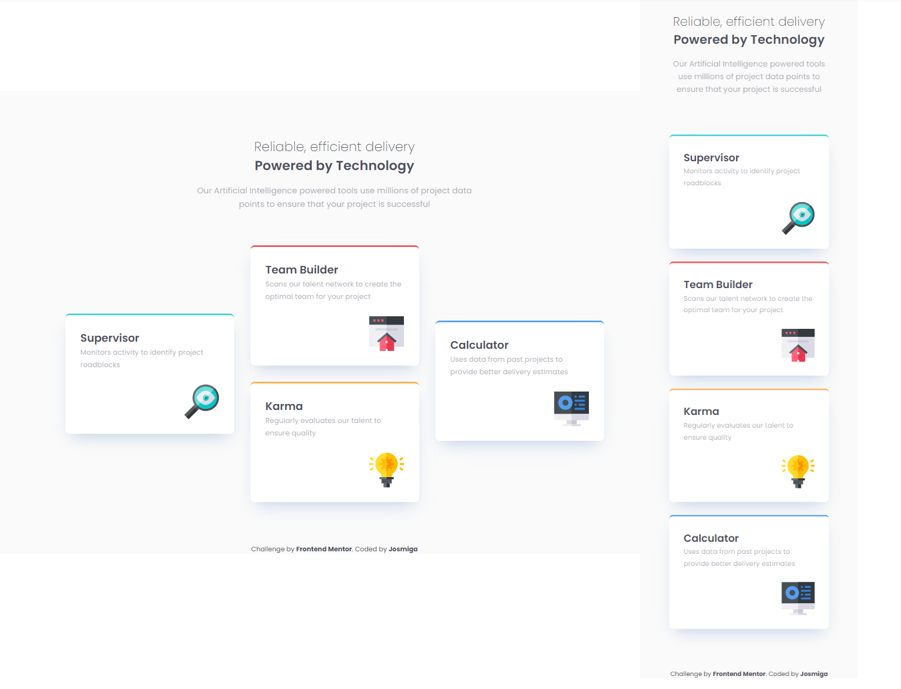

# Frontend Mentor - Four card feature section solution

This is a solution to the [Four card feature section challenge on Frontend Mentor](https://www.frontendmentor.io/challenges/four-card-feature-section-weK1eFYK). Frontend Mentor challenges help you improve your coding skills by building realistic projects. 

## Overview
### Screenshot

### Links
- Github Site URL: [Josmiga - Four card feature section challenge](https://josmiga.github.io/four-card-feature-section-master/)

## My process
### Built with
- Semantic HTML5 markup
- CSS custom properties
- Flexbox

## Author
- Frontend Mentor - [@Josmiga](https://www.frontendmentor.io/profile/Josmiga)
- Twitter - [@josmigga](https://www.twitter.com/josmigga)